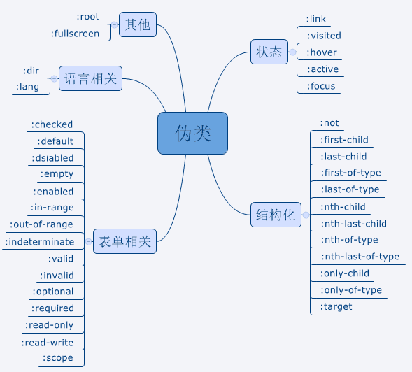
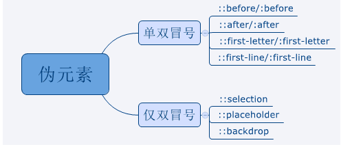

# HTML & CSS

[TOC]

## **HTML**

### cookie sessionStorage localStorage区别

cookie数据始终在同源的http请求中携带(即使不需要)。 

cookie数据还有路径（path）的概念，可以限制。cookie只属于某个路径下 

存储大小限制也不同：

- cookie数据不能超过4K，同时因为每次http请求都会携带cookie，所以cookie只适合保存很小的数据，如回话标识。 
- webStorage虽然也有存储大小的限制，但是比cookie大得多，可以达到5M或更大。

数据的有效期不同

- sessionStorage仅在当前的浏览器窗口关闭有效。
- localStorage始终有效，窗口或浏览器关闭也一直保存，因此用作持久数据。
- cookie：只在设置的cookie过期时间之前一直有效，即使窗口和浏览器关闭。

作用域不同

- sessionStorage不在不同的浏览器窗口中共享，即使是同一个页面
- localStorage和cookie在所有同源窗口都是共享的

### cookie有哪些字段可以设置

`name` 字段为一个cookie的名称。 

`value` 字段为一个cookie的值。 

`domain` 字段为可以访问此cookie的域名。 

- 非顶级域名，如二级域名或者三级域名，设置的cookie的domain只能为顶级域名或者二级域名或者三级域名本身，不能设置其他二级域名的cookie，否则cookie无法生成。 
- 顶级域名只能设置domain为顶级域名，不能设置为二级域名或者三级域名，否则cookie无法生成。 
- 二级域名能读取设置了domain为顶级域名或者自身的cookie，不能读取其他二级域名domain的cookie。所以要想cookie在多个二级域名中共享，需要设置domain为顶级域名，这样就可以在所有二级域名里面或者到这个cookie的值了。
- 顶级域名只能获取到domain设置为顶级域名的cookie，其他domain设置为二级域名的无法获取。 

`path` 字段为可以访问此cookie的页面路径。 比如domain是abc.com,path是/test，那么只有/test路径下的页面可以读取此cookie。 

`expires/Max-Age` 字段为此cookie超时时间。若设置其值为一个时间，那么当到达此时间后，此cookie失效。不设置的话默认值是Session，意思是cookie会和session一起失效。当浏览器关闭(不是浏览器标签页，而是整个浏览器) 后，此cookie失效。 

`Size` 字段 此cookie大小。 

`http` 字段  cookie的httponly属性。若此属性为true，则只有在http请求头中会带有此cookie的信息，而不能通过document.cookie来访问此cookie。 

`secure`  字段 设置是否只能通过https来传递此条cookie

### Doctype作用?严格模式与混杂模式如何区分？它们有何意义? 

Doctype声明于文档最前面，告诉浏览器以何种方式来渲染页面。

**严格模式**的排版和JS 运作模式是 以该浏览器支持的最高标准运行。 

**混杂模式**向后兼容，模拟老式浏览器，防止浏览器无法兼容页面。

### HTML5有哪些新特性

#### 语意化标签

在HTML5中，所有标签具有其书面上的语义，即具有他要传递的内容是什么。语义与显示分离，显示全部由CSS3负责。

```html
<article> <canvas> <footer> <header> <section>
```

**兼容：**

- 为了能让旧版本的浏览器正确显示这些元素可以设置 CSS 的`display 属性值为 block`

- 一般的浏览器都支持html5，ie8以下需要引`html.js`文件来支持。ie9以下会解析它。

  ```html
  <!--[if lt IE 9]>
    <script src="http://cdn.static.runoob.com/libs/html5shiv/3.7/html5shiv.min.js"></script>
  <![endif]-->
  ```

**优点：**

1. 提升可访问性(对于使用ScreenReader)与互操作性
2. 改进搜索引擎优化
3. 一般使HTML文件更小
4. 更好维护，表示层在CSS中

#### SVG矢量图形

> [http://www.runoob.com/svg/svg-tutorial.html](http://www.runoob.com/svg/svg-tutorial.html)

#### Canvas图形绘制

> 使用方法 [https://blog.csdn.net/u012468376/article/details/73350998](https://blog.csdn.net/u012468376/article/details/73350998)

- `<canvas>`看起来和``标签一样，只是 `<canvas>` 只有两个可选的属性 `width、heigth` 属性，而没有 `src、alt` 属性。
- 支持`<canvas>`的浏览器会只渲染`<canvas>`标签，而忽略其中的替代内容。不支持 `<canvas>` 的浏览器则 会直接渲染替代内容。

```html
<canvas id="myCanvas" width="200" height="100">
  你的浏览器不支持canvas,请升级你的浏览器
</canvas>
```

检测浏览器支持性

```javascript
var canvas = document.getElementById('tutorial');
if (canvas.getContext){
  var ctx = canvas.getContext('2d');
  // drawing code here
} else {
  // canvas-unsupported code here
}
```

#### 拖放（Drag 和 Drop）

> 参考 [https://blog.csdn.net/z983002710/article/details/76335122](https://blog.csdn.net/z983002710/article/details/76335122)

dragstart：事件主体是被拖放元素，在开始拖放被拖放元素时触发。

darg：事件主体是被拖放元素，在正在拖放被拖放元素时触发。

dragenter：事件主体是目标元素，在被拖放元素进入某元素时触发。

dragover：事件主体是目标元素，在被拖放在某元素内移动时触发。

dragleave：事件主体是目标元素，在被拖放元素移出目标元素是触发。

drop：事件主体是目标元素，在目标元素完全接受被拖放元素时触发。

dragend：事件主体是被拖放元素，在整个拖放操作结束时触发。

```html
<div id="div1" ondrop="drop(event)" ondragover="allowDrop(event)"></div>
<br>

<script>
  function allowDrop(ev){
    ev.preventDefault();  //默认地，无法将数据/元素放置到其他元素中。如果需要设置允许放置，我们必须阻止对元素的默认处理方式。
}
 
function drag(ev){  //开始拖放操作(拖动什么)
    ev.dataTransfer.setData("Text",ev.target.id);  //方法设置被拖数据的数据类型和值
}
 
function drop(ev){  //（放到何处）
    ev.preventDefault();  //避免浏览器对数据的默认处理（drop 事件的默认行为是以链接形式打开）
    var data=ev.dataTransfer.getData("Text");  //获得被拖数据
    ev.target.appendChild(document.getElementById(data));  //把被拖元素追加到放置元素
}
</script>
```

#### 多媒体 （video & audio)

```html
<video width="320" height="240" controls>
  <source src="movie.mp4" type="video/mp4">
  <source src="movie.ogg" type="video/ogg">
  您的浏览器不支持 HTML5 video 标签。
</video>

<audio controls>
  <source src="horse.ogg" type="audio/ogg">
  <source src="horse.mp3" type="audio/mpeg">
您的浏览器不支持 audio 元素。
</audio>
```

#### 新表单元素和属性

| 标签       | 描述                             |
| :--------- | :------------------------------- |
| <datalist> | 定义输入控件的预定义选项。       |
| <keygen>   | 定义键对生成器字段（用于表单）。 |
| <output>   | 定义计算结果。                   |

- 新的输入类型

  `color` `date` `datetime` `datetime-local` `email` `month` `number` `range` `search` `tel` `time` `url`
`week`

- 新的输入属性

  `autocomplete` `autofocus` `form` `formaction` `formenctype` `formmethod` `formnovalidate` `formtarget` `height 和 width` `list` `min 和 max` `multiple` `pattern (regexp)` `placeholder` `required` `step`


#### localStorage、sessionStorage

localStorage和sessionStorage大于4MB

localStorage永久存储，sessionStorage关闭窗口后消失，保存在本地

#### 离线存储网页

在没有因特网时通过缓存使用网页，在有网络连接时更新网页缓存

```html
<html manifest = "cache.manifest">
...
</html>
```

在cache.mainfest文件内书写缓存规则：

- CACHE:表示需要离线存储的资源列表
- NETWORK:表示在它下面列出来的资源只有在在线的情况下才能访问，他们不会被离线存储
- FALLBACK: 如果第一个资源访问失败，就访问第二个资源替代

#### WebSocket

- WebSocket是HTML5开始提供的一种在单个 TCP 连接上进行全双工通讯的协议。在WebSocket API中，浏览器和服务器只需要做一个握手的动作，然后，浏览器和服务器之间就形成了一条快速通道。两者之间就直接可以数据互相传送。浏览器通过 JavaScript 向服务器发出建立 WebSocket 连接的请求，连接建立以后，客户端和服务器端就可以通过 TCP 连接直接交换数据。当你获取 Web Socket 连接后，你可以通过 **send()** 方法来向服务器发送数据，并通过 **onmessage** 事件来接收服务器返回的数据。

- WebSocket是基于Http协议的，或者说借用了Http协议来完成一部分握手，在握手阶段与Http是相同的。我们来看一个websocket握手协议的实现，基本是2个属性，upgrade，connection。 

- 基本请求如下：

  ```http
  GET /chat HTTP/1.1
  Host: server.example.com
  Upgrade: websocket
  Connection: Upgrade
  Sec-WebSocket-Key: x3JJHMbDL1EzLkh9GBhXDw==
  Sec-WebSocket-Protocol: chat, superchat
  Sec-WebSocket-Version: 13
  Origin: http://example.com
  ```

#### Web Workers

在HTML页面中，如果在执行脚本时，页面的状态是不可相应的，直到脚本执行完成后，页面才变成可相应。web worker是运行在后台的js，独立于其他脚本，不会影响页面的性能。并且通过postMessage将结果回传到主线程。这样在进行复杂操作的时候，就不会阻塞主线程了。 （相当于实现多线程并发）

**如何创建web worker：** 

- 检测浏览器对于web worker的支持性 
- 创建web worker文件（js，回传函数等） 
- 创建web worker对象

#### SSE

Server-Sent 事件指的是网页自动获取来自服务器的更新。

以前也可能做到这一点，前提是网页不得不询问是否有可用的更新。通过服务器发送事件，更新能够自动到达。

例子：Facebook/Twitter 更新、估价更新、新的博文、赛事结果等。

EventSource 对象用于接收服务器发送事件通知：

```javascript
var source=new EventSource("demo_sse.php");
source.onmessage=function(event){
  document.getElementById("result").innerHTML += event.data + "<br>";
};
```

### iframe是什么？有什么缺点？ 

定义：iframe元素会创建包含另一个文档的内联框架

提示：可以将提示文字放在<iframe></iframe>之间，来提示某些不支持iframe的浏览器 

**缺点：** 

- 会阻塞主页面的onload事件。
- 搜索引擎无法解读这种页面，不利于SEO。
- iframe和主页面共享连接池，而浏览器对相同区域有限制所以会影响性能。

### Web Quality（无障碍）

能够被残障人士使用的网站才能称得上一个易用的（易访问的）网站。

残障人士指的是那些带有残疾或者身体不健康的用户。 

> 使用alt属性： 

```html
 
```

有时候浏览器会无法显示图像。具体的原因有： 

- 用户关闭了图像显示 
- 浏览器是不支持图形显示的迷你浏览器 
- 浏览器是语音浏览器（供盲人和弱视人群使用）

如果您使用了`alt` 属性，那么浏览器至少可以显示或读出有关图像的描述。

## **CSS**

### BFC是什么？

> 详见 [https://www.jianshu.com/p/0d713b32cd0d](https://www.jianshu.com/p/0d713b32cd0d)

BFC 全称为 **块级格式化上下文** (Block Formatting Context) ，用于清除浮动，防止margin重叠。

**打开BFC后，元素具有如下属性：**

1. 父元素的垂直外边距不会和子元素重叠。
2. 开启BFC的元素不会被浮动元素覆盖。
3. 开启BFC的元素可以包含浮动的子元素，计算BFC的高度时，浮动元素也会参与计算。

**开启BFC的方法**

1. 设置元素浮动
2. 设置元素绝对定位
3. 设置元素为inline-block
4. 设置overflow: hidden | auto

### CSS3有哪些新特性

#### 选择器

1. E:last-child 匹配父元素的最后一个子元素E。
2. E:nth-child(n)匹配父元素的第n个子元素E。 
3. E:nth-last-child(n) CSS3 匹配父元素的倒数第n个子元素E。
4. ::first-line
5. ::selection

#### 字体

font-face 可以用来加载字体样式，而且它还能够加载服务器端的字体文件，让客户端显示客户端所没有安装的字体。

```css
@font-face {
  font-family: BorderWeb;
  src:url(BORDERW0.eot);
}

.border { font-size: 35px; color: black; font-family: "BorderWeb" }
```

#### 文本效果

1. 换行

```css
`word-break: normal|break-all|keep-all`
```

- normal: 浏览器默认的换行规则。
- break-all: 允许在单词内换行。
- keep-all: 只能在半角空格或连字符处换行。 

```css
`word-wrap: normal|break-word;`
```

- break-word: 允许长单词进行换行。
- normal: 只在允许的断字点换行。 （空格什么的）

2. 超出省略号

```css
text-overflow: ellipsis;
```

#### 圆角

```css
border-radius: 15px;
```

#### 多列布局 multi-column layout

```html
<style>
.mul-col{
  column-count: 3;
  column-gap: 5px;
  column-rule: 1px solid gray;
  border-radius: 5px;
  border:1px solid gray;
  padding: 10px;
}
</style>
<div class="mul-col">
  <div>
    <h3>新手上路</h3>
    <p>新手专区 消费警示 交易安全 24小时在线帮助 免费开店</p>
  </div>
  <div>
    <h3>付款方式</h3>
    <p>快捷支付 信用卡 余额宝 蚂蚁花呗 货到付款</p>
  </div>
  <div>
    <h3>淘宝特色</h3>
    <p>手机淘宝 旺信 大众评审 B格指南</p>
  </div>
</div>
```

#### 阴影 Shadow

```css
text-shadow:5px 2px 6px rgba(64, 64, 64, 0.5);
box-shadow:5px 2px 6px rgba(64, 64, 64, 0.5);
```

#### 渐变效果 gradient

```css
background-image:-webkit-gradient(linear,0% 0%,100% 0%,from(#2A8BBE),to(#FE280E));
```

> linear 表示线性渐变，从左到右，由蓝色（#2A8BBE）到红色（#FE280E）的渐变。效果图如下：


#### 弹性盒子布局 flex

[文内链接🔗](#弹性盒子布局flex)

#### 过渡

- transition-property 对象参与过渡的属性
- transition-duration 过渡的持续时间
- transition-timing-function 过渡的类型
- transition-delay 延迟过渡的时间

```css
//缩写方式
transition:border-color .5s ease-in .1s, background-color .5s ease-in .1s, color .5s ease-in .1s; 

//拆分方式
transition-property:border-color, background-color, color;
transition-duration:.5s, .5s, .5s;
transition-timing-function:ease-in, ease-in, ease-in;
transition-delay:.1s, .1s, .1s;
```

#### 动画

```css
animation-name: myfirst;
animation-duration: 5s;
animation-timing-function: linear;
animation-delay: 2s;
animation-iteration-count: infinite;
animation-direction: alternate;
animation-play-state: running;

@keyframes myfirst
{
  0% {background: red;}
  25% {background: yellow;}
  50% {background: blue;}
  100% {background: green;}
}
```

#### 转换和变形

transform的2D和3D转换

#### 多媒体查询

```html
<link rel="stylesheet" type="text/css" href="site.css" media="screen" />
```

```css
@media all and (min-width: 800px) { ... } //all是媒体类型，也就是说将此CSS应用于所有媒体类型
@media (min-width:800px) and (max-width:1200px) and (orientation:portrait) { ... } //and 
@media (min-width:800px) or (orientation:portrait) { ... } // or
@media (not min-width:800px) { ... } //not
```

### display: none | visibility: hidden | opacity=0区别

**display: none**

1. 浏览器不会生成属性为display: none;的元素。 
2. display: none;元素不占据空间，所以动态改变此属性时会引起重排。 
3. display: none;不会被子类继承，但是子类是不会显示的，毕竟都一起被kill啦。 
4. display是个尴尬的属性，transition对她无效。

**visibility: hidden**

1. 元素会被隐藏，但是不会消失，依然占据空间。 
2. visibility: hidden会被子类继承，子类也可以通过显示的设置visibility: visible;来反隐藏。 
3. visibility: hidden;不会触发该元素已经绑定的事件。 
4. visibility: hidden;动态修改此属性会引起重绘。 
5. visibility,transition对她无效。

**opacity=0**

1. opacity=0只是透明度为100%,元素隐藏，依然占据空间。 
2. opacity=0会被子元素继承,且，子元素并不能通过opacity=1，进行反隐藏。不能。 
3. opacity=0的元素依然能触发已经绑定的事件。
4. opacity, transition对她有效(毫无争议)

### link标签和import标签的区别

- link属于html标签，而@import是css提供的。
- 页面被加载时，link会同时被加载，而@import引用的css会等到页面加载结束后加载。 
- link是html标签，因此没有兼容性，而@import只有IE5以上才能识别。 
- link方式样式的权重高于@import的。

### margin塌陷和margin合并问题及解决方案

**margin塌陷**

父子嵌套元素在垂直方向的margin取其中最大的值。正常情况下，父级元素应该相对浏览器进行定位,子级相对父级定位，但由于margin的塌陷，父级相对浏览器定位.而子级没有相对父级定位，子级相对父级，就像坍塌了一样。

**解决方法**

1. 给父级设置border或padding(不建议使用)
2. 触发[BFC](#BFC是什么？)


**margin合并**

两个兄弟结构的元素在垂直方向上的margin是合并的。

实际应用时，在margin合并这个问题上，我们一般不用bfc，而是通过只设置上面的元素的margin-bottom来解决距离的问题。

### position属性比较

- **static默认定位：**

  默认值。元素出现在正常的流中（忽略top, bottom, left, right 或者 z-index 声明）。

- **relative相对定位：**

  如果对一个元素进行相对定位，它将出现在它所在的位置上。然后，可以通过设置垂直或水平位置，让这个元素“相对于”它的起点进行移动。 在使用相对定位时，无论是否进行移动，元素仍然占据原来的空间。因此，移动元素会导致它覆盖其它框。

- **absolute绝对定位：**

  绝对定位的元素的位置相对于最近的已定位父元素，如果元素没有已定位的父元素，那么它的位置相对于<html>。 absolute定位使元素的位置与文档流无关，因此不占据空间。 absolute定位的元素和其他元素重叠。

- **fixed固定定位：**
  元素的位置相对于浏览器窗口是固定位置，即使窗口是滚动的它也不会移动。Fixed定位使元素的位置与文档流无关，因此不占据空间。 Fixed定位的元素和其他元素重叠。

- **sticky粘性定位：**

  元素先按照普通文档流定位，然后相对于该元素在流中的flow root（BFC）和 containing block（最近的块级祖先元素）定位。而后，元素定位表现为在跨越特定阈值前为相对定位，之后为固定定位。

- **inherit:**

  从父元素继承position属性的值。

### z-index的定位方法

z-index属性设置元素的堆叠顺序，拥有更好堆叠顺序的元素会处于较低顺序元素之前，z-index可以为负，且z-index只能在定位元素上奏效，该属性设置一个定位元素沿z轴的位置，如果为正数，离用户越近，为负数，离用户越远，它的属性值有auto，默认，堆叠顺序与父元素相等，number，inherit，从父元素继承z-index属性的值。

### 盒子模型

content + padding + border + margin

IE盒子模型：width = content + padding + border


标准盒子模型：width = content


```css
box-sizing: content-box | border-box | inherit
```

content-box 对应W3C标准盒子模型 border-box 对应IE盒子模型

### 回流和重绘

**Reflow：** 回流。一般元素的内容、结构、位置或尺寸发生了变化，需要重新计算样式和渲染树。
**Repaint：** 重绘。意味着元素发生的变化只是影响了元素的一些外观之类的时候，此时只需要用新样式绘制这个元素就ok。

### 弹性盒子布局flex

> 详见 [https://www.cnblogs.com/dreamperson/p/9367008.html](https://www.cnblogs.com/dreamperson/p/9367008.html)

**注意点：** 设置了flex后，子元素的css中的float,clear,vertical-align这些属性将失效。

**兼容性：** `chorme 21+` `IE 10+`

**`flex-direction` 属性决定主轴的方向（即项目的排列方向）。**

**`flex-wrap` 属性定义一条轴线排不下时换行方式。**

```css
flex-direction：row | row-reverse | column | column-reverse; 
flex-wrap: nowrap | wrap | wrap-reverse;                      
flex-flow:<flex-direction> || <flex-wrap>; 												/* 合并写法 */
```

**`justify-content` 属性定义了项目在主轴上的对齐方式。**


```css
justify-content: flex-start | flex-end | center | space-between | space-around;
```

**`align-items` 属性定义项目在交叉轴上如何对齐。**

```css
align-items: flex-start | flex-end | center | baseline | stretch;
```

**`align-content` 属性定义了多根轴线的对齐方式。如果项目只有一根轴线，该属性不起作用。**

```css
align-content: flex-start | flex-end | center | space-between | space-around | stretch;
```

**`order` 属性定义项目的排列顺序。数值越小，排列越靠前，默认为0。**

```css
 order:<integer>;
```

**`flex-grow` 属性定义项目的放大比例，默认值为0，即如果存在剩余空间，也不放大。**

- 如果所有项目的flex-grow属性都为1，则它们将等分剩余空间（如果有的话）。
- 如果一个项目的flex-grow属性为2，其他项目为1，则前者占据的剩余空间将比其他项多一倍。

**`flex-shrink `属性定义了项目的缩小比例，默认为1，即如果空间不足，该项目将缩小。**

**`flex-basis` 属性定义了在分配多余空间之前，项目占据的主轴空间（main size）。浏览器根据这个属性，计算主轴是否有多余空间。它的默认值为auto，即项目的本来大小。**

> [深入理解 flex-grow & flex-shrink & flex-basis怎么计算](https://segmentfault.com/a/1190000006741711)

```css
flex-grow: <number>; /* default 0 */
flex-shrink:<number>;/* default 1 */
flex-basis: <length> | auto ; /* default auto */

flex: none | [ <'flex-grow'> <'flex-shrink'>? || <'flex-basis'> ] /* 合并写法 */
```

**`align-self` 属性允许单个项目有与其他项目不一样的对齐方式，可覆盖align-items属性。默认值为auto，表示继承父元素的align-items属性，如果没有父元素，等同于stretch。**

```css
 align-self: auto | flex-start | flex-end | center | baseline | stretch;
```

### 块级元素和行内元素

**块级元素：**

- 总是在新行开始。
- 高度，行高以及外边距和内边距都可控制；
- 宽度缺省是它的容器的100%，除非设定一个宽度。
- 它可以容纳内联元素和其他块元素

**行内元素（内敛元素）：**

- 和其他元素都在一行上；
- 高，行高及外边距和内边距不可改变；
- 宽度就是它的文字或图片的宽度，不可改变
- 内联元素只能容纳文本或者其他内联元素

### 浮动与清除浮动

浮动就是让元素脱离标准流，漂浮在标准流的上面

**会出现的问题：**

1. 高度塌陷：子元素是浮动，父元素的高度为0 

2. 三个同级子元素，前两者设置浮动，后者会顶到前面。

**清除浮动的方法：** 

1. 使用带clear属性的空元素 

   在浮动元素后使用一个空元素如<div class="clear"></div>，并在CSS中赋予.clear{clear:both;}属性即可清理浮动。亦可使用<br class="clear" />或<hr class="clear" />来进行清理。 

2. 使用CSS的overflow属性 

   给浮动元素的容器添加overflow:hidden;或overflow:auto;可以清除浮动，另外在 IE6 中还需要触发 hasLayout ，例如为父元素设置容器宽高或设置 zoom:1。 

   在添加overflow属性后，浮动元素又回到了容器层，把容器高度撑起，达到了清理浮动的效果。 

3. 给浮动元素的容器添加浮动

   给浮动元素的容器也添加上浮动属性即可清除内部浮动，但是这样会使其整体浮动，影响布局，不推荐使用。 

4. 使用邻接元素处理 

   给浮动元素后面的元素添加clear属性。 

5. 使用:after伪元素 

   结合:after伪元素（注意这不是伪类，而是伪元素，代表一个元素之后最近的元素），给浮动元素的容器添加一个clearfix的class，然后给这个class添加一个:after伪元素实现元素末尾添加一个看不见的块元素（Block element）清理浮动。

### 伪类与伪元素

**伪类：**

伪类用于当已有元素处于的某个状态时，为其添加对应的样式，这个状态是根据用户行为而动态变化的。比如说，当用户悬停在指定的元素时，我们通过：`:hover`来描述这个元素的状态。虽然它和普通的CSS类相似，可以为已有元素添加样式，但是它只有处于dom树无法描述的状态下才能为元素添加样式，所以称其为伪类。



**伪元素：**

伪元素用于创建一些不在文档树中的元素，并为其添加样式。比如说，可以通过：`:before`来在一个元素前增加一些文本，并为这些文本添加样式，虽然用户可以看到这些文本，但是这些文本实际上不在文档树中．



### 垂直居中的方法

1. 父元素固定宽高，子元素设置position: absolute，margin: auto平均分配margin

2. margin负值法

   ```css
   .container{
     width: 500px;
     height: 400px;
     border: 2px solid #379;
     position: relative;
   }
   .inner{
     width: 480px;
     height: 380px;
     background-color: #746;
     position: absolute;  /*绝对定位*/
     top: 50%;						 /*50% top*/
     left: 50%;           /*50% left*/
     margin-top: -190px;  /*height的一半*/
     margin-left: -240px; /*width的一半*/
   }
   ```

3. 父元素设置成display: table, 子元素设置为单元格 display: table-cell。

4. 父元素设置为display:flex，并且设置align-items: center; justify-content: center;

5. 子元素设置position: absolute; left: 50%; top: 50%; transform: translate(-50%,-50%);即可。

## **响应式布局**

响应式Web设计可以让一个网站同时适配多种设备和多个屏幕，可以让网站的布局和功能随用户的使用环境（屏幕大小、输入方式、设备/浏览器能力）而变化。


### 约束视口

> width=device-width   视口为设备宽度（就是人设置的一个宽度）//不设置的话默认为980px
> initial-scale=1.0          初始化的视口大小是1.0倍
> maximum-scale=1.0  最大的倍数是1.0倍
> user-scalable=0          不允许缩放视口

```html
<meta name="viewport" content="width=device-width, initial-scale=1.0, maximum-scale=1.0, user-scalable=0" />
```

