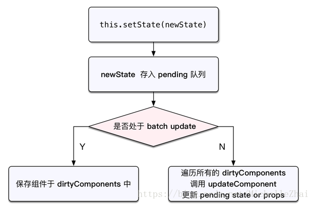
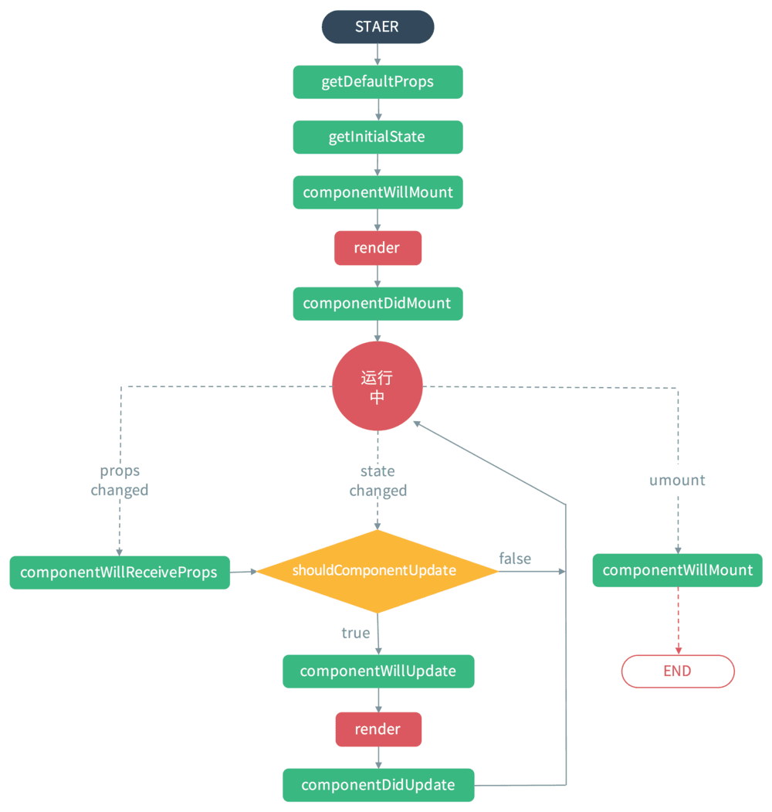
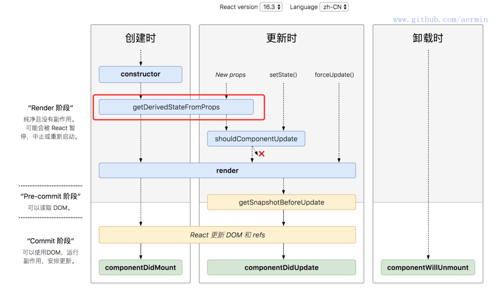
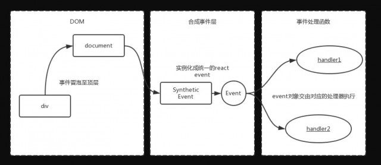

# React & Redux

[TOC]

## React

### react与vue的区别

1. react兼容性更好，vue不兼容ie8
2. react采用jsx语法，而vue使用html模版语法。
3. 一般大项目用react,小项目用vue。
4. 维护团队不同，react是社区维护，维护的更加全面一些。

### react特点及优势

**优点：**

1. 对虚拟dom操作，而不是真实dom，减少了不必要的渲染。
2. 组件化，模块化。每个模块是组件，组件化开发，可维护性高。
3. 单向数据流。对于数据的传递更容易控制，比较有序，有便于管理。
4. 跨浏览器兼容。

**缺点：**

1. 当父组件重新渲染时，子组件即便props和state没有变化也必须重新渲染。
2. 需要依赖很多的其他模块。

**特点：**

1. 声明式渲染。React采用声明范式，可以轻松描述应用。
2. 高效。React通过对DOM的模拟，最大限度地减少与DOM的交互。
3. 灵活。React可以与已知的库或框架很好地配合。

### react原理

React使用虚拟DOM机制，对于每一个组件，React会在内存中构建一个相对应的DOM树，基于React开发时所有的DOM操作都基于虚拟DOM进行，每一次数据变化后，React都会先更新内存中的虚拟DOM，然后通过Diff算法，对比真实的DOM元素，获取DOM结构变化的部分（Pathchs），然后将这些Pathchs更新到真实的DOM中。

由于所有的过程都是在内存中进行，因此非常高效。

### setstate原理

在React的生命周期和合成事件执行前后都有相应的钩子，分别是pre钩子和post钩子，pre钩子会调用batchedUpdate(批量更新)方法将isBatchingUpdates变量置为true，开启批量更新，而post钩子会将isBatchingUpdates置为false



isBatchingUpdates变量置为true，则会走批量更新分支，setState的更新会被存入队列中，待同步代码执行完后，再执行队列中的state更新。

而在原生事件和异步操作中，不会执行pre钩子，或者生命周期的中的异步操作之前执行了pre钩子，但是pos钩子也在异步操作之前执行完了，isBatchingUpdates必定为false，也就不会进行批量更新。

这样可以减少组件的渲染次数，提高性能。

> React的batch update是采用Transaction（事物）来实现的。Transaction对函数进行包装，让React有机会在函数执行前和执行后运行特定的逻辑。

Transaction的执行机制：

1. 在事件initiallize阶段，创建update queue。
2. 调用setState时，状态不会自理调用，而是被push进update queue。
3. 函数执行结束调用事件close阶段，update queue会被flush。

相比于React，**Vue**是采用Event Loop。

> React基于Transaition实现的Batch Query是一个不以来语言特性的通用模式，因此有**更稳定可控**的表现。但缺点是无法覆盖所有情况。比如setTimeout的回调函数不受React控制。 由于setTimeout等要离开主线程进行异步操作时会脱离当前的UI事物，在进入此次处理时batchUpdate=false。所以setState几次就render几次。

```javascript
// setState的另外一种方式
// 传入一个function 第一个参数为上一次更新后的state 第二个参数为应用更新时的props
this.setState((prevState,props) => {
	return { index : prevState.index + 1 + props.index };
})
```

#### setState的基本过程

setState的调用会引起React的更新生命周期的4个函数执行。

shouldComponentUpdate
componentWillUpdate
render
componentDidUpdate

当shouldComponentUpdate执行时，返回true，进行下一步，this.state没有被更新
返回false，停止，更新this.state

当componentWillUpdate被调用时，this.state也没有被更新

直到render被调用时候，this.state才被更新。

总之，直到下一次render函数调用(或者下一次shouldComponentUpdate返回false时)才能得到更新后的this.state
因此获取更新后的状态可以有3种方法：

**1. setState函数式**

**2. setState在setTimeout，Promise等异步中执行**

```javascript
setStatePromise(updator) {
    return new Promise(((resolve, reject) => {
        this.setState(updator, resolve);
    }));
}

componentWillMount() {
    this.setStatePromise(({ num }) => ({
        num: num + 1,
    })).then(() => {
        console.log(this.state.num);
    });
}

// 方法二
function setStateAsync(nextState){  
  return new Promise(resolve => {
    this.setState(nextState, resolve);
  });
}

async func() {  
  ...
  await this.setStateAsync({count: this.state.count + 1});
  await this.setStateAsync({count: this.state.count + 1});
}
```

**3. setState callback**

```javascript
setState({
    index: 1
}}, ()=>{
    console.log(this.state.index);
})
```

**4. componentDidUpdate**

```javascript
componentDidUpdate(){
    console.log(this.state.index);
}
```


### 组件生命周期

分为三个部分： 实例化，存在期和销毁期。

**实例化：**

- getDefaultProps 用来设置默认的props对于每个组件实例，该方法只调用一次
- getInitialState 初始化每个实例的state，此时props可以被访问到
- componentWillMount 组件即将挂载，组件渲染之前
- render 创建一个虚拟dom 必须方法
- componentDidMount 组件挂载，已渲染出真实的DOM 可以通过this.getDOMNode() 或者 ReactDOM.findDOMNode()获取真实DOM节点

**存在期：**

- componentWillReceiveProps 当父组件传入的props发生变化时触发
- shouldComponentUpdate 决定组件是否需要更新 false则不会更新
- componentWillUpdate 在组件接受到新的props或者state即将重新渲染 （别用this.setState）
- render
- componentDidUpdate 组件重新渲染之后

**销毁时：**

- componentWillUnmount 组件销毁前 完成所有的清理工作和销毁工作，包括定时器，事件监听器




#### React v16.3新引入两个生命周期函数getDerivedStateFromProps、getSnapshotBeforeUpdate

**static getDerivedStateFromProps(nextProps, prevState):** 组件接受新的props时，它应该返回一个对象来更新状态，或者返回null来不更新任何内容，而不会做其他的会影响state的值的操作。

```javascript
// before
componentWillReceiveProps(nextProps) {
  if (nextProps.isLogin !== this.props.isLogin) {
    this.setState({ 
      isLogin: nextProps.isLogin,   
    });
  }
  if (nextProps.isLogin) {
    this.handleClose();
  }
}

// after
static getDerivedStateFromProps(nextProps, prevState) {
  if (nextProps.isLogin !== prevState.isLogin) {
    return {
      isLogin: nextProps.isLogin,
    };
  }
  return null;
}

componentDidUpdate(prevProps, prevState) {
  if (!prevState.isLogin && this.props.isLogin) {
    this.handleClose();
  }
}
```

getDerivedStateFromProps还禁止组件去访问this.props，强制让开发者去比较nextProps与prevState的值，以确定在使用时，是根据当前的props去更新组件的state，而不是做一些奇怪的事让组件的状态变的难以预测。

componentWillUpdate 可以读取当前某个DOM元素的状态，componentDidUpdate 中使用 componentWillUpdate 中读取到的 DOM 元素状态是不安全的。

 此时就需要**getSnapshotBeforeUpdate(prevProps, prevState)**

```jsx
class ScrollingList extends React.Component {
  constructor(props) {
    super(props);
    this.listRef = React.createRef();
  }

  getSnapshotBeforeUpdate(prevProps, prevState) {
    // 我们是否要添加新的 items 到列表?
    // 捕捉滚动位置，以便我们可以稍后调整滚动.
    if (prevProps.list.length < this.props.list.length) {
      const list = this.listRef.current;
      return list.scrollHeight - list.scrollTop;
    }
    return null;
  }

  componentDidUpdate(prevProps, prevState, snapshot) {
    // 如果我们有snapshot值, 我们已经添加了新的items.
    // 调整滚动以至于这些新的items 不会将旧items推出视图。
    // (这边的snapshot是 getSnapshotBeforeUpdate方法的返回值)
    if (snapshot !== null) {
      const list = this.listRef.current;
      list.scrollTop = list.scrollHeight - snapshot;
    }
  }

  render() {
    return (
      <div ref={this.listRef}>{/* ...contents... */}</div>
    );
  }
}
```




### props与state

**props 属性**

1. 单向数据流：从父级传向子级。
2. 只读性：子级中无法改变其值。

**state 属性**

1. 组件保存、控制以及修改自己的状态。数据状态。
2. 组件的私有属性。
3. 只能通过setState来修改。

**有状态组件和无状态组件**的区别：有无state。

### diff算法原理

1. 把树形结构按照层级分解，只比较同级元素。
2. 把列表结构的每个单元添加唯一的key属性，方便比较。
3. React只会匹配相同组件名的component。
4. 合并操作。（批量更新）调用component的setState的时候，React将其设为dirty,事件循环结束后，对dirty组件进行重新绘制。
5. 选择性子树渲染。

开发人员可以重写shouldComponentUpdate提高diff的性能。

### Key详解

react利用key来识别组件，它是一种身份标识标识。每个key对应一个组件，相同的key react认为是同一个组件，这样**后续相同的key对应组件都不会被创建**。

有了key属性后，就可以与组件建立了一种对应关系，react根据key来决定是销毁重新创建组件还是更新组件。

- key相同，若组件属性有所变化，则react只更新组件对应的属性；没有变化则不更新。
- key值不同，则react先销毁该组件(有状态组件的`componentWillUnmount`会执行)，然后重新创建该组件（有状态组件的`constructor`和`componentWillUnmount`都会执行）

由数组创建的子组件必须有key属性，**默认**上React帮我们做了，它是以数组的`index`作为key的。

若数组的内容只是作为纯展示，而不涉及到数组的动态变更，其实是可以使用`index`作为key的。

但是，若涉及到数组的动态变更，例如数组新增元素、删除元素或者重新排序等，这时index作为key会导致展示错误的数据。

### react事件机制

#### 特点

- 使用事件委托机制，以队列的方式，从触发事件的组件向父组件回溯直到document节点，因此React组件上声明的事件最终绑定到了document上。由此减少了DOM操作，优化了性能。
- 基于虚拟DOM实现SyntheticEvent合成事件。

#### 事件注册

ReactEventListener负责事件注册。

1. ReactDOM.render()会调用_renderSubtreeInfoContainer方法将Element添加到container。
2. _renderSubtreeInfoContainer首先会创建新Element的虚拟DOM，在该虚拟DOM上做操作。
3. 将虚拟DOM转换成组件，通过_updateDOMProperties方法更新虚拟DOM属性。包括onclick。
4. 通过enqueuePutListener方法负责注册和存储事件。
5. 使用listenTo负责注册事件。（主要解决了不同浏览器间的捕获和冒泡不兼容问题）
6. 采用事物队列的方式调用putListener将注册的事件存储起来，以供事件触发时回调。

事件回调方法是在什么阶段触发？

事件回调方法在bubble阶段被触发。如果我们想让它在capture阶段触发，则需要在事件名上加capture。调用trapCapturedEvent和trapBubbledEvent来注册捕获和冒泡事件。

#### 事件存储

由EventPluginHub来负责，入口为putListener，实际调用的是EventPluginHub.js中的putListener方法，EventPluginHub.js主要负责事件的存储、合成事件以对象池的方式实现创建和销毁。

```javascript
putListener: function (inst, registrationName, listener) {
// key用来标识被注册事件react对象的NoodID。
var key = getDictionaryKey(inst);
//如果listenerBank存在registrationName事件元素取出该值，否则初始化。比如该实例中listenerBank[‘OnClick’]
var bankForRegistrationName = listenerBank[registrationName] || (listenerBank[registrationName] = {});
//将该组件的注册的OnClick事件存入,即listenerBank[‘OnClick’][key] = listener；    bankForRegistrationName[key] = listener;
// EventPluginRegistry事件注册 插件，用于合成和分发事件，EventPluginRegistry.registrationNameModules[registrationName]用来提取’OnClick’的事件回调插件模型。
var PluginModule = 
EventPluginRegistry.registrationNameModules[registrationName];
    if (PluginModule && PluginModule.didPutListener) {
      PluginModule.didPutListener(inst, registrationName, listener);
    }
}
```

#### 事件分发

当事件触发时，注册在document上的回调函数会被触发。

1. 事件触发的入口函数是ReactEventListener.dispatchEvent，负责分发已注册的回调函数。
2. 在这个函数中会调用batchingStrategy 的 batchUpdate 方法实现批处理更新。
3. batchUpdate以transaction形式调用，批量处理更新。

```javascript
function handleTopLevelImpl(bookKeeping) {
// 获取原生的事件target
  var nativeEventTarget = getEventTarget(bookKeeping.nativeEvent);
// 获取原生事件的target所在的组件，它是虚拟DOM
  var targetInst = ReactDOMComponentTree.getClosestInstanceFromNode(nativeEventTarget);
  var ancestor = targetInst;
// 向上遍历所有的祖先节点并存到bookKeeping.ancestors 中。
// 因为事件回调中可能会改变Virtual DOM结构,所以要先遍历好组件层级 
 do {
    bookKeeping.ancestors.push(ancestor);
    ancestor = ancestor && findParent(ancestor);
  } while (ancestor);
// 从当前组件向上遍历，依次执行注册的回调方法。这是一个冒泡的过程。
  for (var i = 0; i < bookKeeping.ancestors.length; i++) {
    targetInst = bookKeeping.ancestors[i];
    ReactEventListener._handleTopLevel(bookKeeping.topLevelType, targetInst, bookKeeping.nativeEvent, getEventTarget(bookKeeping.nativeEvent));
  }
}
```

#### 事件回调

各个节点分别调用ReactEventListener._handleTopLevel（）方法来触发被注册的回调函数。

#### 事件合成

React不是将click事件绑定在该div的真实DOM上，而是在document处监听所有支持的事件，当事件发生并冒泡到document处时，React将事件内容封装并交由真正的处理函数运行。

由于原生事件需要绑定在真实DOM上，所以一般是在componentDidMount阶段/ref的函数执行阶段进行绑定操作，在componentWillUnmount阶段进行解绑操作以避免内存泄漏。



#### 总结

- 一是事件绑定，ReactBrowserEventEmitter的trapBubbledEvent等方法为节点或文档绑定事件；
- 二是事件监听，ReactEventListener.dispatchEvent将把该回调函数分发给事件对象的_dispatchListener属性；调用ReactBrowserEventEmitter.ReactEventListener方法以监听节点事件。
- 三是事件分发与触发，对触发的事件进行分发，并创建合成事件对象，在回调中用构建合成事件对象并执行合成事件对的象绑定回调。

### component和purecomponent的区别

PureComponent 会对当前组件的state和props 做一个浅比较，比较发生在componentShouldUpdate，以判断是否要重新渲染组件。

PureComponent 一般只用在纯展示组件上。

### 受控组件和不受控组件

不受控组件是指html原生的，比如<input>,<textarea> 其值由组件内部维护，并基于用户输入来更新。当提交的时候元素的值会随表单一起发送。而react编写组件的时候，可以通过state获取表单组件的值，并且通过onchange方法更新state，重新渲染组件。一个表单组件，当他的值通过这种方式来控制，就是受控组件。

### 容器组件和展示组件

传入什么就展示什么，通过props来控制组件的展示状态，而不受redux的影响，就是展示组件。

容器组件往往连接到redux，是用来描述如何运行的，监听着redux state，一旦redux state变化，页面就发生变化的组件。 称为容器组件。

### 高阶组件

高阶函数是一个函数，它接收函数作为参数或将函数作为输出返回。

高阶组件是一个入参为组件，并且返回一个新组件的纯函数。

例如redux的`connect`函数与 antd的`const ExportDetail = Form.create()(Update);`

### react性能优化

react性能查看方法： React Perf 在url后直接加 ?react_pref 就可以在控制台查看

1. 定制shouldComponentUpdate
2. 给每个同级的重复性东西，例如item设置key
3. render中尽量减少新建变量和bind函数。
4. 能用const声明的就用const。
5. 减少对真实DOM的操作

## Redux

Redux是javascript状态容器，提供可预测化的状态管理。

**redux的思想：** 控制state，让state的变化变得可以预测，核心思想是，通过申明action，来确定state由于什么而发生变化，state有哪些变化的方式。reducer将state和action联系起来，最后返回新的state的函数。每个state可能都要对应一个reducer。

### **三大原则**

1. 单一数据源。整个应用的state存储在一棵object tree中，这个对象树只存在于唯一一个store中。
2. state是只读的。唯一修改state的方法是触发action，action是描述发生了什么事件的对象。
3. 使用纯函数来执行修改。为了描述action如何改变object tree，需要编写reducer。

**action:** 需要定义type 来指定要执行的动作。

**action创建函数:** 返回action，使的action更容易移植和测试。

**reducer:** 指定了应用状态的变化如何响应actions并发送到store的，action只是描述了事情发生这一事实。

**Store：** 把action和reducer联系在一起的对象。

- 维持应用的 state；
- 提供 getState() 方法获取 state；
- 提供 dispatch(action) 方法更新 state；
- 通过 subscribe(listener) 注册监听器;
- 通过 subscribe(listener) 返回的函数注销监听器。

`let store = createStore(todoApp, window.STATE_FROM_SERVER)` 第二个参数是用来 初始化state

### connect方法

作用：将redux的中的state与dispatch通过props传递给组件，使得组件可以与redux的state绑定，即让组件成为一个容器组件。

好处：用contect的好处是这个方法做了很多的性能优化来避免不必要的重复渲染。这样就不必为了性能优化而手动实现componentShouldUpdate方法了。

### Provider组件

Provider组件是react-redux提供的一个组件，用来将store传递给子组件。因为通过connect的时候，需要获取state，这时候如果将store引入，会十分麻烦。因此可以在最外层写Provider组件，并且将store作为属性传入即可。

原理：Provider获取到store后，并声明为context的属性之一。子组件声明了contextTypes之后，可以通过this.context.store访问到store。

### 谈谈react context的理解

他就像是组件的作用域。用于父子组件，多层级组件的传值。如果不想逐层传递props或者state的方式来传递数据时，可以用Context Api。可以**跨域组件**进行数据传递。

```javascript
// father component
// 父组件需要静态方法childContextTypes声明提供给子组件的Context对象的属性
static childContextTypes = {
  propsA: PropTypes.string,
  methodA: PropTypes.func
}
getChildContext() {
  return { propsA: 'props'}
}

// child components 
// 子组件需要声明contextTypes,才能访问父组件的值，不然访问不到
static contextTypes = {
  propA: PropTypes.string
}

render() {
  const propsA = this.context.prosA
}
```

### redux中间件

- redux-thunk — 用最简单的方式搭建异步 action 构造器
- redux-promise — 遵从 FSA 标准的 promise 中间件
- redux-axios-middleware — 使用 axios HTTP 客户端获取数据的 Redux 中间件
- redux-observable — Redux 的 RxJS 中间件
- redux-rx — 给 Redux 用的 RxJS 工具，包括观察变量的中间件
- redux-logger — 记录所有 Redux action 和下一次 state 的日志
- redux-immutable-state-invariant — 开发中的状态变更提醒
- redux-unhandled-action — 开发过程中，若 Action 未使 State 发生变化则发出警告
- redux-analytics — Redux middleware 分析
- redux-gen — Redux middleware 生成器
- redux-saga — Redux 应用的另一种副作用 model
- redux-action-tree — Redux 的可组合性 Cerebral-style 信号
- apollo-client — 针对 GraphQL 服务器及基于 Redux 的 UI 框架的缓存客户端

**redux-thunk的作用**

搭建异步action构造器。解决的思想为将action creator修改，由一开始的传回对象，到可以传回一个function。这样的话，store.dispatch就可以接受一个方法了。在action creator中可以添加异步方法，并触发store的dispathc方法为变量赋值。

精炼概括：redux-thunk中间件，修改dispatch，使得dispatch可以接受一个函数（而不是只能接受action），并将store.dispatch传入这个函数。

**redux-sage的作用**

redux-sage是一个用于管理应用程序副作用的资源。redux-sage是redux的中间件，这个线程可以从主应用程序停止，开始和取消。

精炼概括：redux-sage中间件，在action触发reducer之外，在触发副作用的操作。Sage是一个可以用来处理复杂的异步逻辑的模块，并且由redux的action触发。

call 可以接受promise对象，将异步变同步 put 就是redux的dispatch操作。

## react-router

react-router是保证一个url对应一个components，也就是页面。确保一个页面是一个路由。

1. 嵌套路由。
2. 路径语法。
3. 优先级。

History对象

browserHistory: 浏览器真实url hashHistory: 使用url中的hash（#）部分创建路由 createMemoryHistory: Memory history不会在地址栏被操作或读取。

**实现原生的路由**

1. **切换页面：** 路由的最大作用就是切换页面，以往后台的路由是直接改变了页面的url方式促使页面刷新。但是前端路由通过 # 号不能刷新页面，只能通过 window 的监听事件 hashchange 来监听hash的变化，然后捕获到具体的hash值进行操作。
2. **注册路由：** 我们需要把路由规则注册到页面，这样页面在切换的时候才会有不同的效果。
3. **异步加载js** ：一般单页面应用为了性能优化，都会把各个页面的文件拆分开，按需加载，所以路由里面要加入异步加载js文件的功能。异步加载我们就采用最简单的原生方法，创建script标签，动态引入js。
4. **参数传递：** 在我们动态引入单独模块的js之后，我们可能需要给这个模块传递一些单独的参数。这里借鉴了一下jsonp的处理方式，我们把单独模块的js包装成一个函数，提供一个全局的回调方法，加载完成时候再调用回调函数。

## Dva

基于redux + redux-saga 的数据流方案。内置react-router,fetch等。是一个轻量级的应用框架。

Modal 将数据模块分离出来。 

namespaces // 命名空间

state // 当前modal的state变量

effect // 异步操作 副作用

reducers // 描述如何修改state

subscription //订阅一个数据源

history //路由变化