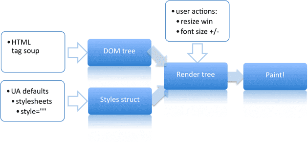
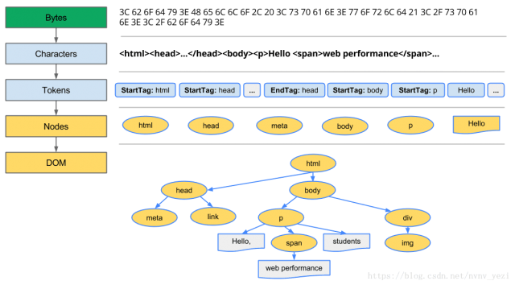
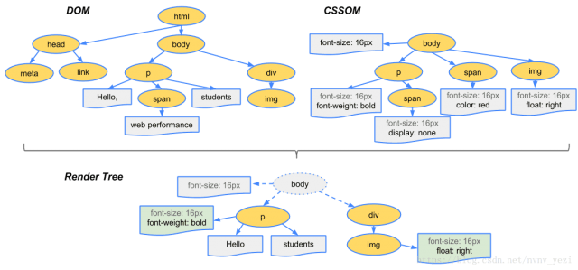
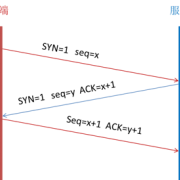
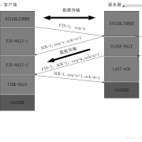

# http & 浏览器 & 网络安全 & 网络原理

[TOC]

## http

### http和https

**http协议**： 超文本传输协议。是一种详细规定了浏览器和万维网服务器之间互相通信的规则。

**http会出现的问题**：http是明文传输协议，交互过程与数据传输都没有加密过，通信双方也没有任何的认证。

**https协议**：是以安全为目的的http通道，http安全版。在http下加SSL层，加密的详细内容需要ssl。

**保证安全的措施**：

1. 一是通过建立一个信息安全通道，来保证数据传输的安全。
2. 确认网站的真实性。

**https加密的方式**：

1. 通过ssl证书来验证服务器的身份。
2. 为客户端与服务器建立ssl安全信息通道（ssl加密通道）。

**http与https的区别**

1. http是明文传输，https是基于ssl加密的传输协议。
2. 连接方式不同，端口号不同 http(80) https(443)
3. http是简单的 无状态的连接，https 协议是由SSL+HTTP协议构建的可进行加密传输、身份认证的网络协议
4. https 内容经过对称加密，每个连接生成一个唯一的加密密钥（**对称密钥**:对称密钥加密又叫专用密钥加密，即发送和接收数据的双方必使用相同的密钥对明文进行加密和解密运算。
5. HTTPS 内容传输经过完整性校验

**https实现的原理**

1. 客户端发送ssl连接给服务器
2. 服务器接受后，与客户端协商证书的版本号等信息，将ca公钥返回给客户端。
3. 客户端接受到ca后，去第三方ca机构，验证ca的合法性
4. 如合法，则生成一串随机数，通过公钥加密，返回给服务器
5. 服务器接收到请求后，使用自己的私钥解密，获取随机数。
6. 于是客户端和服务器有了一串相同的随机数。实现了对称密钥。
7. 进行数据传输，服务器和客户端双方用公有的相同的对称秘钥对数据进行加密解密，可以保证在数据收发过程中的安全。

### http与https的区别

1. http是明文传输，https是基于ssl加密的传输协议。
2. 连接方式不同，端口号不同 http(80) https(443)
3. http是简单的 无状态的连接，https 协议是由SSL+HTTP协议构建的可进行加密传输、身份认证的网络协议
4. https 内容经过对称加密，每个连接生成一个唯一的加密密钥（**对称密钥**:对称密钥加密又叫专用密钥加密，即发送和接收数据的双方必使用相同的密钥对明文进行加密和解密运算。
5. HTTPS内容传输经过完整性校验

### http1.0 1.1 2.0的区别

**http 1.0**：

1. 短连接
2. 只有当一个tcp连接结束后，才会进入下一个连接

**http 1.1**：

1. 长连接： `connecion: keey-alive` 或者 `close`。
2. host字段：用来明确表示浏览器要服务器上的哪一个WEB站点,这才实现了在一台WEB服务器上可以在同一个IP地址和端口号上使用不同的主机名来创建多个虚拟WEB站点,同时还支持了断点续传.
3. 管道(管线化)：客户端可以同时发多个请求给服务端，服务端需按顺序返回响应给客户端。
4. 缓存：断点续传。

**http 2.0**：

1. 二进制分帧(frame)： 在应用层和传输层之间增加了一个二进制分帧层,也就是把http1.x的header和body使用帧(frame)进行了封装。
2. 多路复用：实现了并发发送。所有的HTTP2.0通信都在一个TCP连接上完成，这个连接可以承载任意数量的双向数据流,每个数据流都以消息的方式进行发送,这个发送可以使乱序的,然后在通过每个帧头部的流标识符进行组装,同时每个数据流都可以设置优先级.
3. 头部压缩：就是和服务端约定头部的数据的编码,来将头部进行压缩后发送,这样就可以增加请求头的容量。
4. 服务器端推送（需要手动实现）。

### http请求和响应

**http请求**
分为请求头，请求体，请求起始行三部分。

服务器在收到浏览器的http请求之后，会将收到http报文封装成http的Request对象，并通过服务器的处理，处理完的结果以http的Response对象返回，主要包括状态码、响应头、响应报文三部分。

**响应头**
由Cache-Contol、Connection、Date、Pragma等组成。

**响应体**
服务器返回给浏览器的信息，主要由HTML,css,js,图片文件组成。

**状态码**
1xx：指示信息–表示请求已接收，继续处理。
2xx: 成功–表示请求已被成功接收、理解、接受。
3xx: 重定向–要完成请求必须进行更进一步的操作。
4xx: 客户端错误–请求有语法错误或请求无法实现。
5xx: 服务端错误–服务器未能实现合法的请求。

### http有哪些请求方法？它们的作用或者说应用场景？

* `GET`请求指定的页面信息，并返回实体主体。
* `HEAD`和GET类似，只不过不返回报文主体，只返回响应首部。可用于确认URI的有效性及资源更新的日期时间。
* `POST`向指定资源提交数据进行处理请求（例如提交表单或者上传文件）。数据被包含在请求体中。POST请求可能会导致新的资源的建立和/或已有资源的修改。
* `PUT`用来传输文件，要求请求报文的主体中包含文件内容，然后保存到请求URI指定的位置。  
* `DELETE`和PUT相反，按请求URI删除指定的资源。
* `OPTIONS`用来查询针对请求URI指定的资源支持的方法。如果请求成功，会有一个Allow的头包含类似“GET,POST”这样的信息。
* `TRACE`让服务端将之前的请求通信返回给客户端的方法（因此客户端可以得知请求是怎么一步步到服务端的）。主要用于测试或诊断。
* `CONNECT`使用 SSL（Secure Sockets Layer，安全套接层）和 TLS（Transport Layer Security，传输层安全）协议把通信内容加密后经网络隧道传输。

### http常用请求头

* `Accept`可接受的响应内容类型（Content-Types）。
* `Accept-Charset`可接受的字符集
* `Accept-Encoding`可接受的响应内容的编码方式。
* `Accept-Language`可接受的响应内容语言列表。
* `Accept-Datetime`可接受的按照时间来表示的响应内容版本
* `Authorization`用于表示HTTP协议中需要认证资源的认证信息
* `Cache-Control`用来指定当前的请求/回复中的，是否使用缓存机制。
* `Connection`客户端（浏览器）想要优先使用的连接类型
* `Cookie`由之前服务器通过Set-Cookie（见下文）设置的一个HTTP协议Cookie
* `Content-Length`以8进制表示的请求体的长度
* `Content-MD5`请求体的内容的二进制 MD5 散列值（数字签名），以 Base64 编码的结果
* `Content-Type`请求体的MIME类型 （用于POST和PUT请求中）
* `Date`发送该消息的日期和时间（以RFC 7231中定义的"HTTP日期"格式来发送）
* `Expect`表示客户端要求服务器做出特定的行为
* `From`发起此请求的用户的邮件地址
* `Host`表示服务器的域名以及服务器所监听的端口号。如果所请求的端口是对应的服务的标准端口（80），则端口号可以省略。
* `If-Match`仅当客户端提供的实体与服务器上对应的实体相匹配时，才进行对应的操作。主要用于像 PUT 这样的方法中，仅当从用户上次更新某个资源后，该资源未被修改的情况下，才更新该资源。
* `If-Modified-Since`允许在对应的资源未被修改的情况下返回304未修改
* `If-None-Match`允许在对应的内容未被修改的情况下返回304未修改（ 304 Not Modified ），参考 超文本传输协议 的实体标记
* `If-Range`如果该实体未被修改过，则向返回所缺少的那一个或多个部分。否则，返回整个新的实体
* `If-Unmodified-Since`仅当该实体自某个特定时间以来未被修改的情况下，才发送回应。
* `Max-Forwards`限制该消息可被代理及网关转发的次数。
* `Origin`发起一个针对跨域资源共享的请求（该请求要求服务器在响应中加入一个Access-Control-Allow-Origin的消息头，表示访问控制所允许的来源）。
* `Pragma`与具体的实现相关，这些字段可能在请求/回应链中的任何时候产生。
* `Proxy-Authorization`用于向代理进行认证的认证信息。
* `Range`表示请求某个实体的一部分，字节偏移以0开始。
* `Referer`表示浏览器所访问的前一个页面，可以认为是之前访问页面的链接将浏览器带到了当前页面。Referer其实是Referrer这个单词，但RFC制作标准时给拼错了，后来也就将错就错使用Referer了。
* `TE`浏览器预期接受的传输时的编码方式：可使用回应协议头Transfer-Encoding中的值（还可以使用"trailers"表示数据传输时的分块方式）用来表示浏览器希望在最后一个大小为0的块之后还接收到一些额外的字段。
* `User-Agent`浏览器的身份标识字符串
* `Upgrade`要求服务器升级到一个高版本协议。
* `Via`告诉服务器，这个请求是由哪些代理发出的。
* `Warning`一个一般性的警告，表示在实体内容体中可能存在错误。

### http状态码

* `100` Continue 该状态码说明服务器收到了请求的初始部分，并且请客户端继续发送
* `200` OK 请求成功。一般用于GET与POST请求
* `201` Created 已创建。成功请求并创建了新的资源
* `202` Accepted 已接受。已经接受请求，但未处理完成
* `203` Non-Authoritative Information 非授权信息。请求成功。但返回的meta信息不在原始的服务器，而是一个副本
* `204` No Content 无内容。服务器成功处理，但未返回内容。在未更新网页的情况下，可确保浏览器继续显示当前文档
* `205` Reset Content 重置内容。服务器处理成功，用户终端（例如：浏览器）应重置文档视图。可通过此返回码清除浏览器的表单域
* `206` Partial Content 部分内容。服务器成功处理了部分GET请求
* `300` Multiple Choices 多种选择。请求的资源可包括多个位置，相应可返回一个资源特征与地址的列表用于用户终端（例如：浏览器）选择
* `301` Moved Permanently 永久移动。请求的资源已被永久的移动到新URI，返回信息会包括新的URI，浏览器会自动定向到新URI。今后任何新的请求都应使用新的URI代替
* `302` Found 临时移动。与301类似。但资源只是临时被移动。客户端应继续使用原有URI
* `303` See Other 查看其它地址。与301类似。使用GET和POST请求查看
* `304` Not Modified 未修改。所请求的资源未修改，服务器返回此状态码时，不会返回任何资源。客户端通常会缓存访问过的资源，通过提供一个头信息指出客户端希望只返回在指定日期之后修改的资源
* `305` Use Proxy 使用代理。所请求的资源必须通过代理访问
* `306` Unused 已经被废弃的HTTP状态码
* `307` Temporary Redirect 临时重定向。与302类似。使用GET请求重定向
* `400` Bad Request 客户端请求的语法错误，服务器无法理解
* `401` Unauthorized 请求要求用户的身份认证
* `402` Payment Required 保留，将来使用
* `403` Forbidden 服务器理解请求客户端的请求，但是拒绝执行此请求
* `404` Not Found 服务器无法根据客户端的请求找到资源（网页）。通过此代码，网站设计人员可设置"您所请求的资源无法找到"的个性页面
* `500` Internal Server Error 服务器内部错误，无法完成请求
* `501` Not Implemented 服务器不支持请求的功能，无法完成请求
* `502` Bad Gateway 作为网关或者代理工作的服务器尝试执行请求时，从远程服务器接收到了一个无效的响应
* `503` Service Unavailable 由于超载或系统维护，服务器暂时的无法处理客户端的请求。延时的长度可包含在服务器的Retry-After头信息中
* `504` Gateway Time-out 充当网关或代理的服务器，未及时从远端服务器获取请求
* `505` HTTP Version not supported 服务器不支持请求的HTTP协议的版本，无法完成处理

### GET和POST的对比，或者说区别？

* 一般GET用于获取数据，POST用于提交数据。
* GET把参数包含在URL中，POST通过封装参数到请求体中发送。
* GET的参数长度有限制（不同的浏览器和服务器限制不同），POST没有限制。
* GET只能进行url编码，而POST支持多种编码方式。
* GET可以发送的参数只能是ASCII类型，POST没有限制，甚至可以传输二进制。
* GET比POST不安全，因为参数直接暴露在URL上，所以不能用来传递敏感信息。
* 还有GET请求会被保存浏览器历史记录，可以被收藏为书签，而POST请求不能等等。
* GET刷新无害，而POST刷新会再次提交数据。
* GET和POST本质都是TCP连接。不过GET产生一个TCP数据包；POST产生两个TCP数据包。
  * 对于GET方式的请求，浏览器会把http header和data一并发送出去，服务器响应200 OK（返回数据）。
  * 对于POST，浏览器先发送header，服务器响应100 continue，浏览器再发送data，服务器响应200 OK（返回数据）。

## 浏览器相关

### 从打入url到显示页面，浏览器做了什么？

1. 浏览器的地址栏输入URL并按下回车。
2. 浏览器查找当前URL是否存在[缓存](#浏览器缓存机制)，并比较缓存是否过期。
3. DNS解析URL到对应的ip。
4. 根据ip[建立TCP连接（三次握手）](#tcp连接三次握手)。
5. 发起[http请求](#http请求和响应)。
6. 服务端处理请求，发回[响应信息](#http请求和响应)，浏览器接受http响应。
7. 浏览器[渲染页面](#浏览器渲染原理)。
8. [关闭TCP连接（四次握手）](#tcp四次握手释放连接)。

### 浏览器缓存机制

根据是否需要重新向服务器请求来分类。  

* **强缓存：** 判断http首部字段: `cache-control`  `Expires`。
  
  1. `cache-control`常见的取值有private、public、no-cache、max-age，no-store，默认为private。
  
     | 取值        | 定义                                                         |
     | ----------- | ------------------------------------------------------------ |
     | private     | 客户端可以缓存（**默认**）                                   |
     | public      | 客户端和代理服务器都可缓存（前端的同学，可以认为public和private是一样的） |
     | max-age=xxx | 缓存的内容将在 xxx 秒后失效                                  |
     | no-cache    | 需要使用**弱缓存**来验证缓存数据                             |
     | no-store    | 所有内容都不会缓存，强制缓存，对比缓存**都不会触发**         |
  
  2. `Expires` 是一个绝对时间，即**服务器时间**。浏览器检查当前时间，如果没到失效时间就直接用缓存文件。（不过Expires 是HTTP 1.0的东西，现在默认浏览器均默认使用HTTP 1.1，所以它的作用基本忽略。
     另一个问题是，到期时间是由服务端生成的，但是客户端时间可能跟服务端时间有误差，这就会导致缓存命中的误差。
     所以HTTP 1.1 的版本，使用Cache-Control替代）
* **弱缓存：** `Last-modified /  If-Modified-Since`   `Etag / If-None-Match`
  
  1. **Last-modified** 是第一次请求资源时，服务器返回字段，表示最后一次更新的时间。下一次请求发送时，浏览器在头部携带If-modified-since字段，服务器回比较两者，如果认为缓存已过期返回新资源。否则返回304状态码，让浏览器继续缓存。
  
  2. **Etag / If-None-Match**（优先级高于Last-Modified / If-Modified-Since）
  
     服务器响应请求时，告诉浏览器当前资源在服务器的唯一标识Etag（生成规则由服务器决定）。
  
     再次请求服务器时，通过**If-None-Match**通知服务器客户段缓存数据的唯一标识。
     服务器收到请求后发现有头If-None-Match 则与被请求资源的唯一标识进行比对，
     不同，说明资源又被改动过，则响应整片资源内容，返回状态码200；
     相同，说明资源无新修改，则响应HTTP 304，告知浏览器继续使用所保存的缓存。
  
     

### 浏览器渲染原理

浏览器的内核是支持浏览器运行的最核心的程序，分为两个部分的，一是渲染引擎，另一个是JS引擎。渲染引擎在不同的浏览器中不是都相同的。比如Firefox中叫Gecko，Chrome 和 Safari都是基于WebKit开发的（Chrome渲染引擎现在切换为Blink）。

1. 处理 HTML 标记并构建 DOM 树。
2. 处理 CSS 标记并构建 CSSOM 树。
3. 将 DOM 与 CSSOM 合并成一个渲染树。
4. 根据渲染树来布局，以计算每个节点的几何信息。
5. 将各个节点绘制到屏幕上。

**浏览器解析**

1. 浏览器通过请求的URL进行域名解析，向服务器发起请求，接收文件（HTML、CSS、JS、Images等）
2. HTML文件加载后，开始构建DOM Tree
3. CSS样式文件加载后，开始解析和构建CSS Rule Tree
4. javascript脚本文件加载后，通过DOM API和CSSOM API来操作DOM Tree 和 CSS Rule Tree。

**浏览器渲染** （[回流和重绘](#回流和重绘)）

1. 浏览器引擎通过DOM Tree 和 CSS Rule Tree 构建 Rendering Tree。
2. Rendering Tree 并不与 DOM Tree 对应，比如像 标签内容或带有 display: none; 的元素节点并不包括在 Rendering Tree 中。
3. 通过CSS Rule Tree 匹配 DOM Tree 进行定位坐标和大小，是否换行，以及position、overflow、z-index等等属性，这个过程称为Flow或Layout。
4. 最终通过调用Native GUI 的 API 绘制网页画面的过程称为 Paint 。

**具体如何做的？**

1. 转换： 浏览器从磁盘或网络读取HTML的原始字节，并根据文件指定编码将它们转换成各个字符。
2. 令牌化：浏览器将字符串转换成html5规定的令牌，每个令牌都具有特殊含义和一组规则。
3. 词法分析： 发出的令牌转换成定义其属性和规则的对象。
4. DOM构建： 最后，由于 HTML 标记定义不同标记之间的关系（一些标记包含在其他标记内），创建的对象链接在一个树数据结构内，此结构也会捕获原始标记中定义的父项-子项关系：HTML 对象是 body 对象的父项，body 是 paragraph 对象的父项，依此类推。

1. DOM 树与 CSSOM 树合并后形成渲染树。
1. 渲染树只包含渲染网页所需的节点。
1. 布局计算每个对象的精确位置和大小。
1. 最后一步是绘制，使用最终渲染树将像素渲染到屏幕上。

### 回流和重绘

**Reflow：** 回流。一般元素的内容、结构、位置或尺寸发生了变化，需要重新计算样式和渲染树。
**Repaint：** 重绘。意味着元素发生的变化只是影响了元素的一些外观之类的时候，此时只需要用新样式绘制这个元素就ok。

### 前端优化

- 降低请求量：合并资源，减少HTTP 请求数，minify / gzip 压缩，webP，lazyLoad。 
- 加快请求速度：预解析DNS，减少域名数，并行加载，CDN 分发。 
- 缓存：HTTP 协议缓存请求，离线缓存 manifest，离线数据缓存localStorage。 
- 渲染：JS/CSS优化，加载顺序，服务端渲染，pipeline。

## Web安全问题

### XSS 跨站脚本攻击

- 攻击者通过注入恶意指令代码到网页，使用户加载并执行攻击者恶意制造的网页程序。这些恶意网页程序通常是JavaScript，但实际上也可以包括Java、VBScript、ActiveX、Flash 或者甚至是普通的HTML。
- 攻击成功后，攻击者可能得到包括但不限于更高的权限（如执行一些操作）、私密网页内容、会话和cookie等各种内容。

**分类**：

* **DOM XSS**:  DOM即文本对象模型，DOM通常代表在html、xhtml和xml中的对象，使用DOM可以允许程序和脚本动态的访问和更新文档的内容、结构和样式。它不需要服务器解析响应的直接参与，触发XSS靠的是浏览器端的DOM解析，可以认为完全是客户端的事情。
* **反射型 XSS**: 反射型XSS也被称为非持久性XSS，由客户端发出携带在请求中，服务端接收后返回在响应中，在浏览器解析响应时被执行。
* **存储型 XSS**: 存储型XSS也成为持久性XSS，不需要手动触发，攻击者提交代码，被存到数据库，每次请求资源都被执行。

**防御**：

* 服务端设置httpOnly：在cookie中设置HttpOnly属性后，js脚本将无法读取到cookie信息；设置secure - 告诉浏览器仅在请求为https的时候发送cookie。
* 过滤：在表单提交的时候，对所有的参数进行过滤。（antd的提交有问题）
* HtmlEncode转换html标签。
* JavaScriptEncode对字符加上反斜杠。

### CSRF 跨站点请求伪造

- 跨站点请求伪造（Cross-Site Request Forgeries），也被称为one-click attack 或者 session riding。
- 冒充用户发起请求（在用户不知情的情况下）， 完成一些违背用户意愿的事情（如修改用户信息，删初评论等）。

详解CSRF [https://www.cnblogs.com/hyddd/archive/2009/04/09/1432744.html](https://www.cnblogs.com/hyddd/archive/2009/04/09/1432744.html)

**防御**

1. 验证码；强制用户必须与应用进行交互，才能完成最终请求。此种方式能很好的遏制 csrf，但是用户体验比较差。
2. 尽量使用 post ，限制 get 使用；上一个例子可见，get 太容易被拿来做 csrf 攻击，但是 post 也并不是万无一失，攻击者只需要构造一个form就可以。
3. Referer check；请求来源限制，此种方法成本最低，但是并不能保证 100% 有效，因为服务器并不是什么时候都能取到 Referer，而且低版本的浏览器存在伪造 Referer 的风险。
4. token；token 验证的 CSRF 防御机制是公认最合适的方案。

### Click jacking

点击劫持，是指利用透明的按钮或连接做成陷阱，覆盖在 Web 页面之上。然后诱使用户在不知情的情况下，点击那个连接访问内容的一种攻击手段。这种行为又称为界面伪装(UI Redressing) 。

1. X-FRAME-OPTIONS  HTTP 响应头是用来给浏览器指示允许一个页面可否在`<frame>`, `<iframe>` 或者 `<object>` 中展现的标记。
2. js 判断顶层窗口跳转，可轻易破解，意义不大；

如何配置
1. Apache 
 `Header always append X-Frame-Options SAMEORIGIN`
2. Nginx
 `add_header X-Frame-Options SAMEORIGIN;添加到 'http', 'server' 或者 'location'，配置中`
3. IIS

## 计算机网络

### 计算机网络各层涉及的协议

**应用层：**

* **DNS** (Domain Name System)域名系统<端口号53>，它用于TCP/IP网络，将主机名和域名转换为IP地址。
* **FTP**（File Transfer Protocol）文件传输协议<端口号21>减少或消除不同操作系统下处理文件的不兼容性。
* **HTTP**（Hypertext Transfer Protocol ）超文本传输协议 <端口号80>， 面向事务的应用层协议。
* **SMTP**（Simple Mail Transfer Protocol ）简单邮件传输协议 <端口号25> 用于发送邮件。
* **RPC** （Remote Procedure Call Protocol ）（RFC-1831）远程过程调用协议。

**传输层：**

* **TCP**  传输控制协议提供可靠的面向连接的服务，传输数据前须先建立连接，结束后释放。可靠的全双工信道。可靠、有序、无丢失、不重复。
* **UDP** 用户数据报协议发送数据前无需建立连接，不使用拥塞控制，不保证可靠交付，最大努力交付。

**网络层：**

*  **IP** (IPv4 · IPv6) (Internet Protocol) 网络之间互连的协议
* **ARP** (Address Resolution Protocol) 即地址解析协议，实现通过IP 地址得 知其物理地址。
* **RARP** (Reverse Address Resolution Protocol)反向地址转换协议允许局域 网的物理机器从网关服务器的 ARP 表或者缓存上请求其 IP地址。
* **ICMP** (Internet Control Message Protocol) Internet 控制报文协议。它是TCP/IP 协议族的一个子协议，用于在IP 主机、路由器之间传递控制消息。

**数据链路层：**

* **PPP**(Point-to-Ponit Protocol)点对点协议面向字节，由三部分组成：一个将IP 数据报封装到串行链路的方法；一个用于建立、配置和测试数据链路连接的链路控制协议。
* **CSMA/CD**(Carrrier Sense Multiple Access with Collision Detection)载波监听多点接入/碰撞检测协议。总线型网络，协议的实质是载波监听和碰撞检测。载波监听即发数据前先检测总线上是否有其他计算机在发送数据，如暂时不发数据，避免碰撞。碰撞检测为计算机边发送数据边检测信道上的信号电压大小。
* **ARQ**（Automatic Repeat-reQuest ）自动重传请求协议，错误纠正协议之一，包括停止等待ARQ 协议和连续ARQ 协议，错误侦测、正面确认、逾时重传与负面确认继以重传等机制。

### TCP连接三次握手

* 第一次握手：建立连接时，客户端发送syn包（syn = i）到服务器，并进入SYN_SENT状态，等待服务器确认；
* 第二次握手：服务器接收到syn包，必须确认客户的SYN(ack = i + 1)，同时自己也发送一个SYN包（syn = k）,即SYN+ACK包，此时服务器进入SYN_RECY状态。
* 第三次握手：客户端收到服务器的SYN+ACK包，向服务器发送确认包(ack = k + 1)，此包发送完毕，客户端和和服务端都进入ESTABLISHED（TCP连接成功）状态，完成三次握手。

### TCP四次握手释放连接

* 第一次握手：客户端到服务端，发送FIN，告诉服务端，我准备好结束了。
* 第二次握手：服务端发送ack，告知客户端，我已经收到你的结束信息了。
* 第三次握手：服务端发送FIN给客户端，告知客户端，我也准备好结束了。
* 第四次握手：客户端回复ack给服务端，告诉服务端，好的，结束吧。

### TCP和UDP的区别

* TCP是面向连接的，UDP是无连接的，即发送数据前不需要先建立链接。
* TCP提供可靠的服务，通过TCP连接传送的数据，无差错，不丢失，不重复，且按序到达（适合大数据量的交换）。
  UDP尽最大努力交付，即不保证可靠交付。
* TCP是面向字节流，UDP面向报文，并且网络出现拥塞不会使得发送速率降低（因此会出现丢包，对实时的应用比如IP电话和视频会议等）。
* TCP只能是1对1的，UDP支持1对1,1对多。
* TCP的首部较大为20字节，而UDP只有8字节。